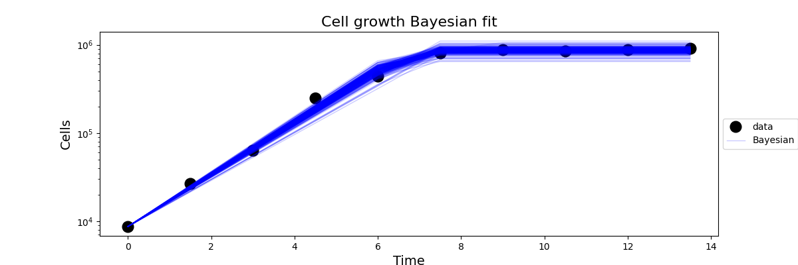
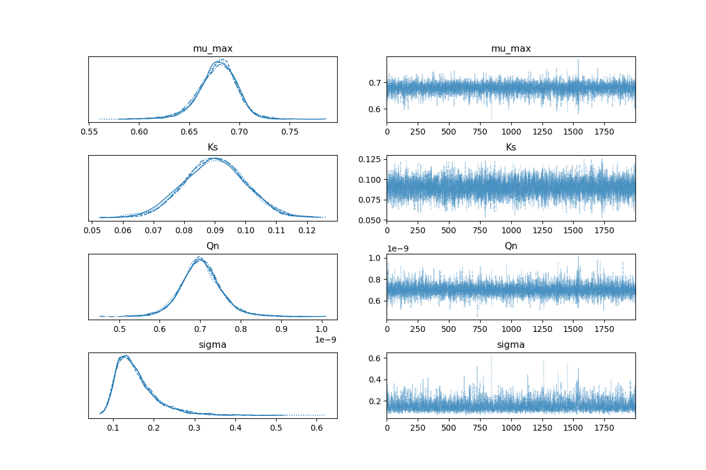

# pymc-ODE-inference: PyMC for ODE-based Bayesian Inference with Python
_pymc-ODE-inference_ is a repository to study Biologically inspired dynamical systems with mechanistic models (such as ODEs) with Python. Inferring parameters of a mechanistic models involves answering a lot of questions:
- How can we incorporate prior information about parameters and models into our modeling framework?
- How does the choice of the model affect the estimates of the inferred parameters?
- How can we use a Bayesian approach (for example, MCMC type samplers) to model these systems?

We want to compare different methods and techniques on simple _in-silico_ of _experimental_ datasets.

## Installation 📥

First clone the repository and create a virtual environment, where you can install the required packages. The Bayesian framework is based on _pymc_, the backend is based on _numba_ and _jax_, the parameter estimation process might use _tensorflow_

```
git clone git@github.com:kennedihambrick/PYMC-ODE-inference.git
cd pymc-ODE-inference
python3 -m venv pymc-ode
source pymc-ode/bin/activate
pip install -r requirements.txt
```

## Getting started

Once you have cloned the repository you can look at a simple example of modeling a growth-curve of cells driven by resources, modeled by an ODE.

[Simple demonstration](./notebooks/bayesian_fits-diff_samplers.ipynb)
Here is an example of the modeled cell growth using Slice sampler for parameters and NUTS for $\sigma_{LL}$ (likelihood).

<p align="center">
  <picture>
    
  </picture>
</p>

<p align="center">
  <picture>
    
  </picture>
</p>


## FAQ
- Language and implementation: Pymc
- ODE solver: C-api implementation of numpy/scipy.
- Error Model: Half Gaussian model; assumped independence of points, multiplicative likelihood, compared log(data)  with log(model)
- Convergence tests: Gelman rubin, Autocorrelation of chains, geweke.
- Post processing: burn = 2000 (not needed that much); thinning: minimal requirements for NUTS, MetropolisZ: needed.


## Review:
Here's the convention we used (for now).
- init_vary: Sampled Initial conditions.
- init_fixed: Initial condition fixed from data. $N_0 = 600$.
- You can find chains saved in [results](./results/)
- You can find plots saved in [figures](./figures/)


## Contributions.
- Original github repository by [Raunak Dey](https://sites.google.com/view/raunak-dey/home) at UMD.
- This is an updated github repository by [Kennedi Hambrick] at UTK.
- Part of the big-project led by [David Talmy](https://eeb.utk.edu/people/david-talmy/).
- Please feel free to reach out to me for more information at khambri3@vols.utk.edu
